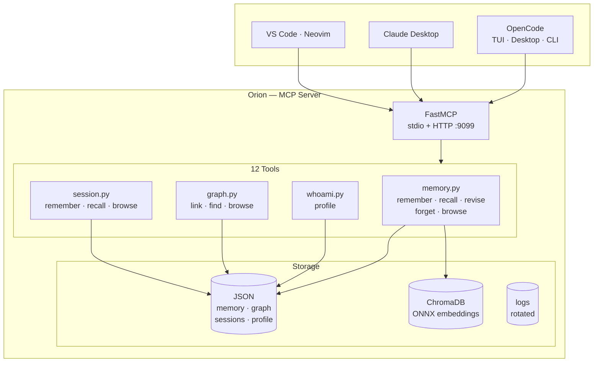
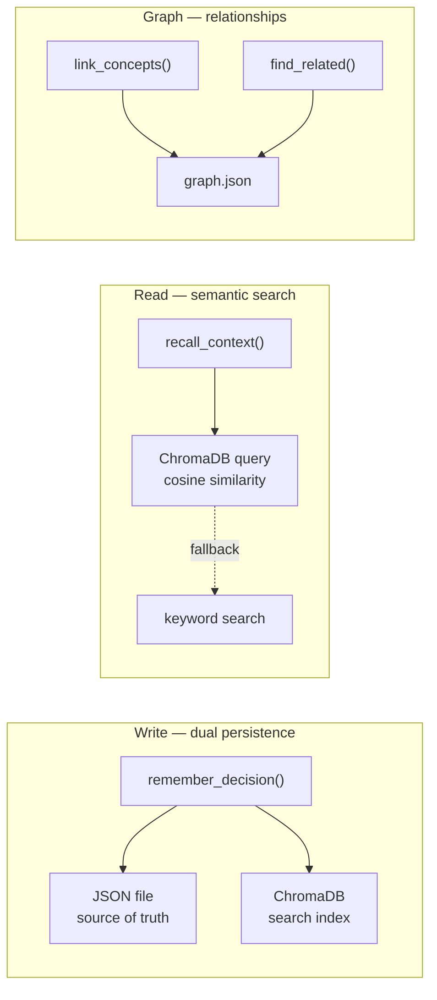

<p align="center">
  
</p>

<p align="center">
  
  
  
  
  
  
  
  
</p>

---

<br>

MCP server that provides **persistent memory**, **semantic search**, **knowledge graphs**,
and **session context** to AI coding assistants.

 <br>

|  Memory |  Search |  Graph |  Profile |  Sessions |
|:---:|:---:|:---:|:---:|:---:|
| Store & recall decisions | ChromaDB ONNX embeddings | Typed relationships | Juan's context | Cross-session brain |

<br>

---



##   Quick start

```bash
# Clone & install
git clone https://github.com/jdvalmart/orion && cd orion
python -m venv .venv && source .venv/bin/activate
pip install -r requirements.txt

# Run
python server.py                              # stdio (default)
python server.py --transport http --port 9099  # HTTP mode

# Auto-start on login
systemctl --user enable --now orion
```

##   Connect

<details open>
<summary>  OpenCode</summary>

```jsonc
{
  "mcp": {
    "orion": {
      "type": "local",
      "command": [".venv/bin/python", "server.py"]
    }
  }
}
```
</details>

<details>
<summary>  Claude Desktop</summary>

```json
{
  "mcpServers": {
    "orion": {
      "command": "/path/to/orion/.venv/bin/python",
      "args": ["/path/to/orion/server.py"]
    }
  }
}
```
</details>

<details>
<summary>  HTTP / cURL</summary>

```bash
curl -X POST http://localhost:9099/mcp \
  -H "Content-Type: application/json" \
  -d '{"jsonrpc":"2.0","id":1,"method":"tools/list"}'
```
</details>

##   Tools

|  Tool |  Group | Description |
|------|-------|-------------|
| `remember_decision` |  Memory | Store an architectural decision with tags |
| `recall_context` |  Search | Semantic search via ChromaDB ONNX embeddings |
| `revise_decision` |  Memory | Update fields of an existing decision |
| `forget_decision` |  Memory | Permanently delete a decision by ID |
| `browse_memories` |  Memory | List all stored decisions |
| `whoami` |  Profile | Juan's professional profile and context |
| `link_concepts` |  Graph | Create typed relationships between decisions |
| `find_related` |  Graph | Explore all connections for a decision |
| `browse_graph` |  Graph | List all relationships in the graph |
| `remember_session` |  Session | Save a development session summary |
| `recall_session` |  Session | Restore master context across sessions |
| `browse_sessions` |  Session | List recorded development sessions |

##   Architecture



##   Development phases

|  # |  Name |  Status | Key deliverable |
|---|------|--------|-----------------|
| 1 |  Foundation | ✅ Complete | 6 tools, dual transport, JSON persistence |
| 2 |  RAG | ✅ Complete | ChromaDB ONNX, semantic search |
| 3 |  Knowledge Graph | ✅ Complete | Typed relationships — link, find, browse |
| 4 |  Session Memory | ✅ Complete | Hybrid context — master brain |

##   Quality

```bash
pip install -r requirements-dev.txt
ruff check .   && echo "  Lint passed"
ruff format .  && echo "  Format passed"
mypy .         && echo "  Types passed"
```

##   Structure

```
orion/
├── server.py              #   CLI entrypoint
├── app.py                 #   FastMCP instance
├── tools/
│   ├── memory.py          #   5 memory tools
│   ├── whoami.py          #   1 profile tool
│   ├── graph.py           #   3 graph tools
│   └── session.py         #   3 session tools
├── orion_config.py        #   paths, logging, ChromaDB
├── data/                  #   persistent   (gitignored)
├── logs/                  #   runtime       (gitignored)
├── docs/
│   ├── ACTA.md            #   founding act + roadmap
│   └── DEVELOPER.md       #   AI assistant rules
├── pyproject.toml         #   ruff + mypy config
└── requirements.txt
```

---

<p align="center">
  <sub>Part of <a href="https://github.com/jdvalmart">universo</a> — Orion · Vela · Draco · Lyra · Ara</sub>
</p>
